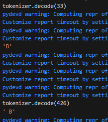

# LLama_behavior_classification
Study into Llama-3's ability to reason and our ability to classify its behaviors from the hidden states and attention maps

## Data

We will gather data from the MMLU dataset as well as the ARC-AGI dataset, and preprocess it into multiple choice, one-token answer formats. 

- MMLU (almost ready)
- ARC-AGI (not started)

TODO:
- clean up structure of the data into one train, val, test datasets ready for inference. 
- Process ARC-AGI dataset into proper format. 

## Activations

We will keep the hidden states and the attention maps for analysis. The model must output a single token response for the activations to make any sense. 

- hidden states (done)
- attention maps (done)

TODO: 
- Setup inference mechanism with capture of the hidden states and attention maps

Issues:

How to handle the fact that capital letters like A, B, C, D have multiple token representations? Seems like we can't filter the output probs by specific dict entries. Unless we know for sure that " A" is the correct output token instead of "A" for Llama. 
